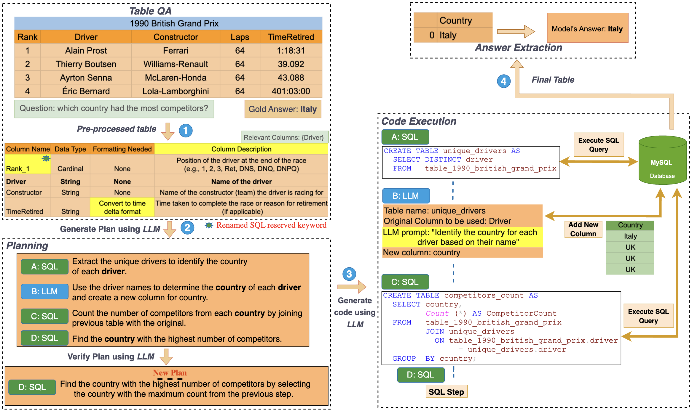

# Weaver: Interweaving SQL and LLM for Table Reasoning

[](https://arxiv.org/pdf/2505.18961)
[](https://www.python.org/)
[](LICENSE)

<!-- Add your main architecture/results image here -->


## Abstract

**Weaver** is a modular pipeline that dynamically combines SQL and Large Language Models (LLMs) for advanced table-based question answering. Unlike rigid approaches, Weaver generates flexible execution plans that use SQL for structured data operations and LLMs for semantic reasoning, automatically deciding the best tool for each subtask. Our method consistently outperforms state-of-the-art approaches across four major TableQA datasets while reducing API costs and improving accuracy through intelligent query decomposition.


**Paper**: [Weaver: Interweaving SQL and LLM for Table Reasoning](https://arxiv.org/pdf/2505.18961)

---

## 🚀 Quick Start

### Installation

1. **Clone the repository**:
```bash
git clone https://github.com/rohitkhoja/weaver.git
cd weaver
```

2. **Install dependencies**:
```bash
pip install -r requirements.txt
```

3. **Install Weaver**:
```bash
pip install -e .
```

### Setup Configuration

1. **Copy the environment template**:
```bash
cp .env.example .env
```

2. **Configure your `.env` file** with the following **essential** settings:

```bash
# 🔑 REQUIRED: LLM API Key (choose one provider)
OPENAI_API_KEY=your-openai-api-key-here

# 🎯 REQUIRED: LLM Model (LiteLLM format: provider/model)
LLM_MODEL=openai/gpt-4o-mini

# 📁 REQUIRED: Dataset Directory (where your CSV files are stored)
WEAVER_DATASETS_DIR=./datasets

# 🗄️ REQUIRED: Database Configuration (MySQL recommended)
WEAVER_DB_TYPE=mysql
WEAVER_DB_HOST=localhost
WEAVER_DB_PORT=3306
WEAVER_DB_NAME=weaver_db
WEAVER_DB_USER=root
WEAVER_DB_PASSWORD=your-mysql-password

# 📊 Optional: Logging Level
WEAVER_LOG_LEVEL=INFO
```

> **⚠️ Important**: For now, **use MySQL** as the database backend. Support for other databases is in progress.

### MySQL Setup

Make sure you have MySQL installed and running:

```bash
# Create database
mysql -u root -p
CREATE DATABASE weaver_db;
exit
```

---

## 💡 Usage Examples

### Single Question Answering

```python
from weaver import TableQA, WeaverConfig

# Initialize with environment configuration
config = WeaverConfig.from_env()
qa = TableQA(config)

# Ask a question using JSON object format
question_obj = {
    "table_id": "example-001",
    "question": "Which country had the most cyclists finish within the top 10?",
    "table_file_name": "./datasets/WikiTableQuestions/csv/203-csv/733.csv",
    "target_value": "Italy",
    "table_name": "2008 Clásica de San Sebastián"
}

result = qa.ask(question_obj)
print(f"Answer: {result.answer}")
print(f"Correct: {result.is_correct}")
```

### Batch Processing

```python
from weaver import TableQA, WeaverConfig

config = WeaverConfig.from_env()
qa = TableQA(config)

# Process multiple questions from a dataset
results = qa.evaluate_dataset(
    dataset_name="wikitq",
    data_path="./datasets/wikitq.json",
    num_samples=100
)

# Calculate accuracy
accuracy = sum(r.is_correct for r in results) / len(results)
print(f"Accuracy: {accuracy:.2%}")
```

### Using with Context (FinQA Example)

```python
question_obj = {
    "table_id": "ADI/2011/page_61.pdf",
    "question": "What is the percentage change in cash flow hedges in 2011 compared to 2010?",
    "table_file_name": "./datasets/FINQA/csv/ADI_2011_page_61.csv",
    "target_value": "9.9%",
    "table_name": "ADI/2011/page_61.pdf",
    "paragraphs": "Additional context about cash flow hedges and financial data..."
}

result = qa.ask(question_obj)
print(f"Answer: {result.answer}")
```

### Command Line Interface

```bash
# Ask a single question
python -m weaver.cli.main ask "Which country won the most medals?" \
    --table-path ./datasets/olympics.csv

# Evaluate on a dataset
python -m weaver.cli.main evaluate wikitq \
    --data-path ./datasets/wikitq.json \
    --num-samples 50

# Show configuration
python -m weaver.cli.main config-info
```

---

## 📁 Dataset Structure

Weaver supports multiple TableQA datasets. Place your data in the structure specified by `WEAVER_DATASETS_DIR`:

```
datasets/
├── WikiTableQuestions/
│   └── csv/
│       └── 203-csv/
│           └── 733.csv
├── FINQA/
│   └── csv/
│       └── ADI_2011_page_61.csv
├── TabFact/
│   └── csv/
├── OTT-QA/
│   └── tables/
├── wikitq.json          # Question dataset
├── finqa.json           # Question dataset
├── tabfact.json         # Question dataset
└── ott-qa.json          # Question dataset
```

### Question Dataset Format

```json
[
  {
    "table_id": "nu-0",
    "question": "Which country had the most cyclists finish within the top 10?",
    "table_file_name": "./datasets/WikiTableQuestions/csv/203-csv/733.csv",
    "target_value": "Italy",
    "table_name": "2008 Clásica de San Sebastián",
    "paragraphs": "Optional context text..."
  }
]
```

---

## 🛠️ Configuration

### Environment Variables Reference

| Variable | Description | Example | Required |
|----------|-------------|---------|----------|
| `OPENAI_API_KEY` | OpenAI API key | `sk-proj-...` | ✅ |
| `LLM_MODEL` | LLM model in LiteLLM format | `openai/gpt-4o-mini` | ✅ |
| `WEAVER_DATASETS_DIR` | Path to datasets directory | `./datasets` | ✅ |
| `WEAVER_DB_TYPE` | Database type | `mysql` | ✅ |
| `WEAVER_DB_HOST` | Database host | `localhost` | ✅ |
| `WEAVER_DB_PORT` | Database port | `3306` | ✅ |
| `WEAVER_DB_NAME` | Database name | `weaver_db` | ✅ |
| `WEAVER_DB_USER` | Database username | `root` | ✅ |
| `WEAVER_DB_PASSWORD` | Database password | `your_password` | ✅ |
| `WEAVER_LOG_LEVEL` | Logging level | `INFO` | ⚪ |
| `LLM_TEMPERATURE` | Model temperature | `0.01` | ⚪ |
| `LLM_MAX_TOKENS` | Max output tokens | `2048` | ⚪ |

### Supported LLM Providers

Weaver uses [LiteLLM](https://litellm.ai/) and supports 100+ LLM providers:

```bash
# OpenAI
export OPENAI_API_KEY="sk-..."
export LLM_MODEL="openai/gpt-4o-mini"

# Anthropic Claude
export ANTHROPIC_API_KEY="sk-ant-..."
export LLM_MODEL="anthropic/claude-3-sonnet-20240229"

```

---

## 🧪 Experiments & Results

Weaver has been evaluated on four major TableQA datasets:

- **WikiTableQuestions**: Complex reasoning over Wikipedia tables
- **TabFact**: Fact verification over tables
- **FinQA**: Financial reasoning with numerical tables
- **OTT-QA**: Open table-and-text QA

Our experiments show that Weaver consistently outperforms state-of-the-art methods while reducing API calls and error rates.

For detailed results and analysis, see our [paper](https://arxiv.org/pdf/2505.18961).

---

## 🏗️ Architecture

Weaver's modular pipeline consists of:

1. **Table Preprocessor**: Handles table loading and column filtering
2. **Context Manager**: Manages paragraphs and external context
3. **Plan Generator**: Creates step-by-step execution plans
4. **SQL-LLM Executor**: Dynamically executes SQL and LLM operations
5. **Answer Extractor**: Formats and validates final answers

The system dynamically decides when to use SQL for structured operations and when to leverage LLMs for semantic reasoning.

---

## 🤝 Contributing

We welcome contributions! Please see [CONTRIBUTING.md](CONTRIBUTING.md) for guidelines.

---

## 📝 Citation

If you use Weaver in your research, please cite our paper:

```bibtex
@misc{khoja2025weaverinterweavingsqlllm,
      title={Weaver: Interweaving SQL and LLM for Table Reasoning}, 
      author={Rohit Khoja and Devanshu Gupta and Yanjie Fu and Dan Roth and Vivek Gupta},
      year={2025},
      eprint={2505.18961},
      archivePrefix={arXiv},
      primaryClass={cs.AI},
      url={https://arxiv.org/abs/2505.18961}, 
}
```

---

## 🙏 Acknowledgments

This work was inspired by and builds upon several important contributions in the field:
- [BlendSQL](https://aclanthology.org/2024.findings-acl.25.pdf) **: A Scalable Dialect for Unifying Hybrid Question Answering in Relational Algebra** 
- [ProTrix](https://aclanthology.org/2024.findings-emnlp.253.pdf) **: Building Models for Planning and Reasoning over Tables with Sentence Context**
- [H-Star](https://aclanthology.org/2025.naacl-long.445/) **: LLM-driven Hybrid SQL-Text Adaptive Reasoning on Tables** 
- [Binder](https://arxiv.org/abs/2210.02875) **: Binding Language Models in Symbolic Languages** 


## 📄 License

This project is licensed under the MIT License - see the [LICENSE](LICENSE) file for details.

---

## 👥 Authors

- **Rohit Khoja** - Arizona State University - [rkhoja2@asu.edu](mailto:rkhoja2@asu.edu)
- **Devanshu Gupta** - Arizona State University - [dgupta77@asu.edu](mailto:dgupta77@asu.edu)
- **Yanjie Fu** - Arizona State University - [yanjiefu@asu.edu](mailto:yanjiefu@asu.edu)
- **Dan Roth** - University of Pennsylvania - [danroth@seas.upenn.edu](mailto:danroth@seas.upenn.edu)
- **Vivek Gupta** - Arizona State University - [vgupt140@asu.edu](mailto:vgupt140@asu.edu)